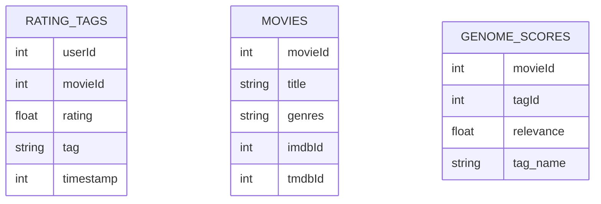
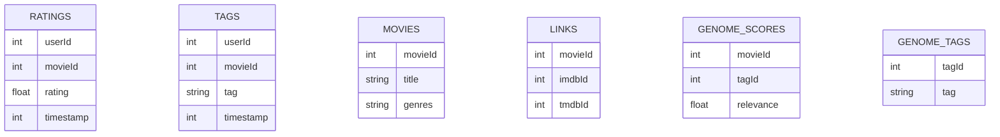

# Mini project for DW & DSS course

## Prerequisites

- `python` 3.10 & `pip` 22.0.2
- `docker` 24.0.7
- `docker-compose` 1.29.2

## Installation

1. Install python dependencies
   ```bash
   pip install -r requirements.txt
   ```
2. Start `ClickHouse` database
   ```bash
   docker-compose up -d
   ```
3. Install pre-commit hooks
   ```bash
   pre-commit install
   ```

All-in-one command:

```bash
pip install -r requirements.txt && docker-compose up -d && pre-commit install
```

## Start application

Run this command:

```bash
uvicorn main:app --reload
```

Swagger documentation will be available at <http://localhost:8000/docs> or <http://localhost:8000/redoc>.

## Play with `ClickHouse` database

```bash
docker exec -it olapdb clickhouse-client
```

See [ClickHouse documentation](https://clickhouse.com/docs/) for more details.

## About data source

Link: <https://drive.google.com/drive/folders/1GOsGgcTkMX8vhhntoVKYliINZ_CEqEmh>.
TL;DR: Run `python etl.py` to extract, transform and load data into `ClickHouse` database.

After successful extraction, this is datawarehouse schema:



### Summary

This dataset (ml-25m) describes 5-star rating and free-text tagging activity from [MovieLens](http://movielens.org), a movie recommendation service. It contains 25000095 ratings and 1093360 tag applications across 62423 movies. These data were created by 162541 users between January 09, 1995 and November 21, 2019. This dataset was generated on November 21, 2019.

Users were selected at random for inclusion. All selected users had rated at least 20 movies. No demographic information is included. Each user is represented by an id, and no other information is provided.

The data are contained in the files `genome-scores.csv`, `genome-tags.csv`, `links.csv`, `movies.csv`, `ratings.csv` and `tags.csv`.

### Data model

Before ETL process:



### Content and Use of Files

#### User Ids

MovieLens users were selected at random for inclusion. Their IDs have been anonymized. User ids are consistent between `ratings.csv` and `tags.csv` (i.e., the same id refers to the same user across the two files).

#### Movie Ids

Only movies with at least one rating or tag are included in the dataset. These movie ids are consistent with those used on the MovieLens web site (e.g., id `1` corresponds to the URL <https://movielens.org/movies/1>). Movie ids are consistent between `ratings.csv`, `tags.csv`, `movies.csv`, and `links.csv` (i.e., the same id refers to the same movie across these four data files).

#### Ratings Data File Structure (ratings.csv)

All ratings are contained in the file `ratings.csv`. Each line of this file after the header row represents one rating of one movie by one user, and has the following format:

    userId,movieId,rating,timestamp

The lines within this file are ordered first by userId, then, within user, by movieId.

Ratings are made on a 5-star scale, with half-star increments (0.5 stars - 5.0 stars).

Timestamps represent seconds since midnight Coordinated Universal Time (UTC) of January 1, 1970.

#### Tags Data File Structure (tags.csv)

All tags are contained in the file `tags.csv`. Each line of this file after the header row represents one tag applied to one movie by one user, and has the following format:

    userId,movieId,tag,timestamp

The lines within this file are ordered first by userId, then, within user, by movieId.

Tags are user-generated metadata about movies. Each tag is typically a single word or short phrase. The meaning, value, and purpose of a particular tag is determined by each user.

Timestamps represent seconds since midnight Coordinated Universal Time (UTC) of January 1, 1970.

#### Movies Data File Structure (movies.csv)

Movie information is contained in the file `movies.csv`. Each line of this file after the header row represents one movie, and has the following format:

    movieId,title,genres

Movie titles are entered manually or imported from <https://www.themoviedb.org/>, and include the year of release in parentheses. Errors and inconsistencies may exist in these titles.

Genres are a pipe(|)-separated list, and are selected from the following:

- Action
- Adventure
- Animation
- Children's
- Comedy
- Crime
- Documentary
- Drama
- Fantasy
- Film-Noir
- Horror
- Musical
- Mystery
- Romance
- Sci-Fi
- Thriller
- War
- Western
- (no genres listed)

#### Links Data File Structure (links.csv)

Identifiers that can be used to link to other sources of movie data are contained in the file `links.csv`. Each line of this file after the header row represents one movie, and has the following format:

    movieId,imdbId,tmdbId

movieId is an identifier for movies used by <https://movielens.org>. E.g., the movie Toy Story has the link <https://movielens.org/movies/1>.

imdbId is an identifier for movies used by <http://www.imdb.com>. E.g., the movie Toy Story has the link <http://www.imdb.com/title/tt0114709/>.

tmdbId is an identifier for movies used by <https://www.themoviedb.org>. E.g., the movie Toy Story has the link <https://www.themoviedb.org/movie/862>.

Use of the resources listed above is subject to the terms of each provider.

#### Tag Genome (genome-scores.csv and genome-tags.csv)

This data set includes a current copy of the Tag Genome.

[genome-paper]: http://files.grouplens.org/papers/tag_genome.pdf

The tag genome is a data structure that contains tag relevance scores for movies. The structure is a dense matrix: each movie in the genome has a value for _every_ tag in the genome.

As described in [this article][genome-paper], the tag genome encodes how strongly movies exhibit particular properties represented by tags (atmospheric, thought-provoking, realistic, etc.). The tag genome was computed using a machine learning algorithm on user-contributed content including tags, ratings, and textual reviews.

The genome is split into two files. The file `genome-scores.csv` contains movie-tag relevance data in the following format:

    movieId,tagId,relevance

The second file, `genome-tags.csv`, provides the tag descriptions for the tag IDs in the genome file, in the following format:

    tagId,tag

The `tagId` values are generated when the data set is exported, so they may vary from version to version of the MovieLens data sets.

Please include the following citation if referencing tag genome data:

> Jesse Vig, Shilad Sen, and John Riedl. 2012. The Tag Genome: Encoding Community Knowledge to Support Novel Interaction. ACM Trans. Interact. Intell. Syst. 2, 3: 13:1–13:44. <https://doi.org/10.1145/2362394.2362395>
